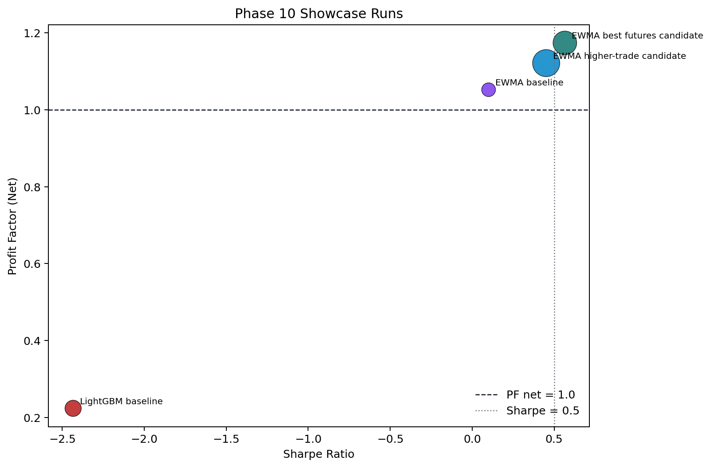

# Chronos-PLG

`chronos-plg` is a phase-gated BTC trading research platform focused on probabilistic forecasting, cost-aware backtesting, robustness screening, and paper-trading governance.

This is not published as a finished trading product. It is published as a serious research system with real code, real experiment artifacts, and honest current findings.

## Research Positioning

The core question behind the project is simple:

Can a probabilistic forecasting stack for BTC generate a positive net edge after realistic execution costs, and survive the governance checks required before any capital promotion?

The answer today is mixed:
- the system can find PF-positive regions in some futures EWMA configurations
- those regions still fail promotion because readiness, stability, and kill-switch constraints remain binding
- 1h spot and margin calibration runs currently show the opposite failure mode: more trades, but weak PF and Sharpe

That mix is exactly why the project is interesting.

## Current Status

### What is implemented

- contract-validated data ingestion and dataset building
- leakage-aware labels and walk-forward evaluation
- baseline model stack: `RandomWalk`, `EWMA`, `LightGBM`
- Chronos-2 candidate runner with fallback/provenance safeguards
- strategy layer with quantile signals, sizing, and regime-aware controls
- realistic cost engine with fee, slippage, funding, and interest handling
- robustness, decision reporting, and kill-criteria checks
- paper-trading replay, monitoring dashboards, readiness policy, and capital-ramp logic
- multi-objective parameter sweep and fixed-candidate promotion campaign tooling

### What the evidence currently says

- best inspected futures candidate:
  - `ProfitFactorNet = 1.1739`
  - `Sharpe = 0.5653`
  - `Trades = 76`
  - outcome still `ITERATE`, not promotion-ready
- 1h spot threshold calibration:
  - top active candidates reached `175-197` trades
  - all remained below acceptable PF / Sharpe thresholds
- fixed spot campaign:
  - `ProfitFactorNet = 0.8509`
  - `Sharpe = -0.8225`
  - `Trades = 94`
  - promotion recommendation: `False`

See [docs/results.md](docs/results.md) and [artifacts/public/public_evidence_snapshot.md](artifacts/public/public_evidence_snapshot.md).

## Why This Repo Is Worth Publishing

Most trading repos fail in one of two ways:
- they are mostly notebooks and vague claims
- they claim profitability without governance, cost realism, or negative-result reporting

This repo is valuable because it does the opposite:
- it treats execution costs as first-class
- it preserves phase gates and kill criteria
- it stores auditable artifacts
- it surfaces both positive and negative evidence

## Visual Snapshot

### Phase 10 showcase comparison



### Best observed futures candidate: gross vs net equity


### 1h threshold calibration: spot vs margin


## Repository Layout

```text
chronos-plg/
├── config/                  # scenario, cost, and runtime configuration
├── src/
│   ├── data/                # ingestion, contracts, labels, quality gates
│   ├── evaluation/          # walk-forward, calibration, multi-objective tooling
│   ├── backtest/            # execution-cost-aware backtest engine and reports
│   ├── strategy/            # signals, sizing, regimes, intent logic
│   ├── robustness/          # kill criteria and stress testing
│   ├── paper_trading/       # replay, monitoring, readiness, capital ramp
│   └── reporting/           # decision and promotion reporting
├── scripts/                 # CLI workflows and publication report generation
├── tests/                   # automated validation
├── docs/                    # publication docs and Pages-ready content
├── artifacts/public/        # curated public evidence snapshots
└── plans/                   # implementation plans and execution scaffolds
```

## Quick Start

### Environment

Create an isolated local environment before running code:

```bash
python -m venv .venv
. .venv/bin/activate
pip install --upgrade pip
pip install -e ".[dev]"
```

### Validate the repo

```bash
make test
make smoke
```

### Generate the public evidence pack

```bash
make public-assets
```

This generates:
- curated evidence snapshots in `artifacts/public/`
- publication figures in `docs/assets/`

## Reproducibility Notes

- the full local `data/` tree is intentionally not part of the public repo surface
- curated evidence is published under `artifacts/public/`
- public figures are generated into `docs/assets/`
- commands and workflow details are documented in [docs/reproducibility.md](docs/reproducibility.md)

## Key Docs

- [Project landing page](docs/index.md)
- [Methodology](docs/methodology.md)
- [Project status](docs/project-status.md)
- [Results](docs/results.md)
- [Experiment log](docs/experiment-log.md)
- [Roadmap](docs/roadmap.md)
- [Reproducibility](docs/reproducibility.md)
- [Implementation plan](plans/2026-04-11-portfolio-publication-implementation-plan.md)

## License

MIT. See [LICENSE](LICENSE).
