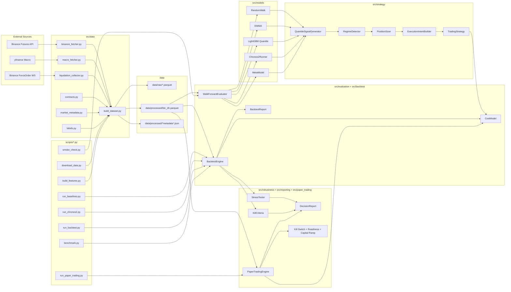
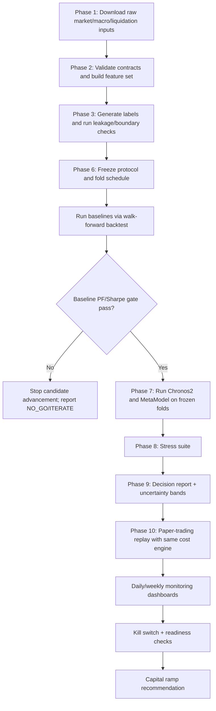

# 02 - Architecture And Pipeline

## System Architecture

## End-To-End Pipeline

## Architectural Design Characteristics

- Causality-first data and fold semantics: explicit feature lag and anti-contamination checks
- Net-cost-first evaluation: cost engine is central in both backtest and paper replay
- Gate-driven lifecycle: baselines gate candidate models; robustness gates viability; paper policy gates deployment
- Auditable artifacts: fold schedules, per-fold metrics, trade-level outputs, decision JSON/TXT, run manifests
