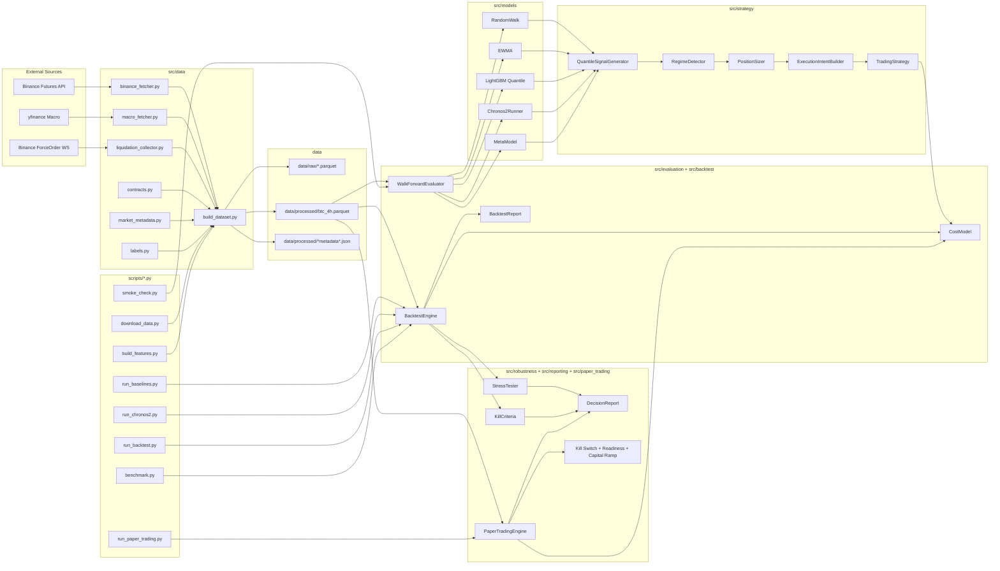
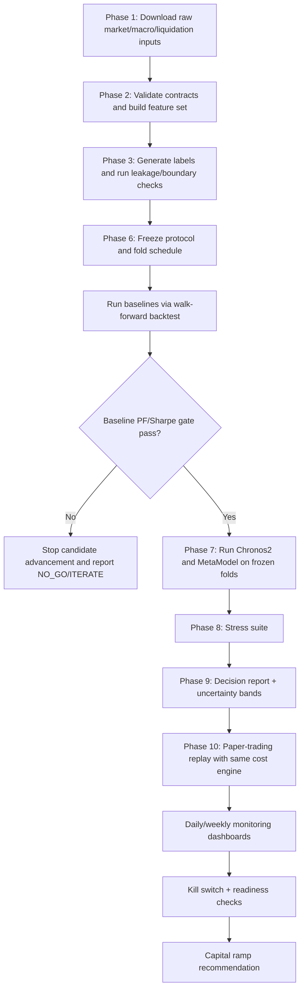

# Codebase Inventory V0.1.0

Generated on: 2026-02-17

This documentation set inventories the current `chronos-plg` codebase and runtime artifacts.

## Scope

- Current architecture and end-to-end pipeline
- File/module responsibilities across `config`, `src`, `scripts`, and `tests`
- Implemented models, strategy mechanics, and execution-cost logic
- Evaluation, robustness, decision, and paper-trading governance
- Current empirical state from latest artifacts in `data/results/phase10_real_20260217`
- Capability matrix, known gaps, and prioritized next implementation targets

# 01 - System Overview And Current State

## What The System Is

`chronos-plg` is a phase-gated, cost-aware trading research and paper-trading system for BTC perpetual/spot/margin scenarios.

Core objective:

- Prove `ProfitFactorNet > 1.0` after fees, slippage, funding, interest, and other modeled costs
- Keep supporting safety gates (Sharpe, drawdown, robustness, regime stability)

## What Is Implemented Right Now

The codebase has a full implementation from Phase 0 through Phase 10, including:

- Exchange/market scenario cost profiles (`binance`, `kucoin`; `spot`, `margin`, `futures`)
- Contract-validated data pipeline with feature/label generation and leakage checks
- Baselines (`RandomWalk`, `EWMA`, `LightGBM`) and candidate models (`Chronos2`, `MetaModel`)
- Strategy stack (quantile signals, regime gating, position sizing, execution-intent layer)
- Execution-event cost engine with transition-leg decomposition and funding/interest accounting
- Walk-forward backtest engine with fold freezing and per-fold audit artifacts
- Robustness framework (cost stress, regime exclusion, adverse window, block bootstrap, rolling stability, parameter sensitivity)
- Phase 9 decision reporting (GO/ITERATE/NO_GO + uncertainty bands)
- Phase 10 paper-trading replay, monitoring dashboards, kill switch, deployment readiness, and capital ramp policy

## Plan Status Snapshot

Source: `CODEBASE-PLAN-V-0.1.md`

- Phases 0-10: marked complete
- V0.1 objective: not yet achieved (secondary criteria/readiness still not met)

## Dataset State Snapshot

Source: `data/processed/btc_4h_metadata.json`, `data/processed/btc_4h_quality.json`

- Dataset: `data/processed/btc_4h.parquet`
- Range: 2024-01-01 00:00:00 UTC to 2026-02-17 16:00:00 UTC
- Rows: 4,673
- Columns: 49 (30 features + 12 labels + OHLCV and metadata-linked fields)
- Index integrity: no gaps, no duplicates

Current coverage realities:

- Funding and macro/event data are available
- Open interest was unavailable in latest processed build (`open_interest` family is 100% null)
- Liquidation features exist structurally but are null in this build because OI-based estimation path had no OI source

## Current Empirical Performance Snapshot (Phase 10)

Source: `data/results/phase10_real_20260217/*_paper_phase10_summary.json`

| Run                                              | PF Net |  Sharpe | Trades | Total Return | Decision |
|--------------------------------------------------|-------:|--------:|-------:|-------------:|----------|
| `ewma_candidate_sharpe565_retrain42_entry178_v4` | 1.1739 |  0.5653 |     76 |        1.05% | ITERATE  |
| `ewma_candidate_span72_entry178_retrain28_v3`    | 1.1213 |  0.4512 |    100 |        0.93% | ITERATE  |
| `ewma`                                           | 1.0521 |  0.1001 |     26 |        0.09% | NO_GO    |
| `lightgbm`                                       | 0.2239 | -2.4337 |     36 |       -1.35% | NO_GO    |

Interpretation of current state:

- There is a measurable net edge region (`PF Net > 1`) in tuned EWMA variants
- Deployment readiness is still failing due trade-count and kill-switch/readiness policy constraints
- The highest-Sharpe candidate has insufficient trade count for current readiness policy

## Where The System Stands Right Now

- Engineering foundation is robust and phase-complete through paper-trading governance
- Research objective is partially met (edge exists), but operational go-live criteria are not met
- Immediate next leverage is in improving trade density and regime stability without collapsing PF/Sharpe under current cost assumptions

# 02 - Architecture And Pipeline

## System Architecture

## End-To-End Pipeline

## Architectural Design Characteristics

- Causality-first data and fold semantics: explicit feature lag and anti-contamination checks
- Net-cost-first evaluation: cost engine is central in both backtest and paper replay
- Gate-driven lifecycle: baselines gate candidate models; robustness gates viability; paper policy gates deployment
- Auditable artifacts: fold schedules, per-fold metrics, trade-level outputs, decision JSON/TXT, run manifests

# 03 - Module And Script Inventory

## Configuration Layer (`config/`)

| File                           | Responsibility                                                                                                      | Key Objects                                                        |
|--------------------------------|---------------------------------------------------------------------------------------------------------------------|--------------------------------------------------------------------|
| `config/settings.py`           | Central defaults for data paths, exchange config, feature/target settings, walk-forward, strategy, model, and costs | `Settings`, `WalkForwardConfig`, `StrategyConfig`, `ModelConfig`   |
| `config/cost_profiles.py`      | Canonical fee schedules for Binance/KuCoin across spot/margin/futures with discount toggles                         | `ExchangeCostProfile`, `MarketFeeProfile`, `get_cost_profile()`    |
| `config/scenario_profiles.py`  | Named benchmark scenarios mapping exchange + market type + order type + funding/interest flags                      | `TradingScenarioProfile`, `get_scenario_profile()`                 |
| `config/baseline_protocols.py` | Immutable Phase-6 protocol definitions with fingerprinting for reproducibility                                      | `BaselineProtocol`, `BaselineModelSpec`, `get_baseline_protocol()` |

## CLI Scripts (`scripts/`)

| Script                         | What It Does                                                                              | Main Outputs                                                                    |
|--------------------------------|-------------------------------------------------------------------------------------------|---------------------------------------------------------------------------------|
| `scripts/download_data.py`     | Fetches OHLCV/funding/OI/macro/event/liquidation raw inputs and optionally builds dataset | `data/raw/*.parquet`, optional processed dataset, run manifest                  |
| `scripts/build_features.py`    | Builds processed dataset from cached raw files                                            | `data/processed/btc_4h.parquet`, metadata JSON                                  |
| `scripts/run_baselines.py`     | Runs frozen Phase-6 baseline protocol with frozen folds and scenario cost model           | model reports, fold metrics, leaderboards, baseline gate artifact               |
| `scripts/run_chronos2.py`      | Runs Phase-7 candidate validation after leakage and baseline gates                        | candidate reports, candidate gates, recent-regime metrics, combined leaderboard |
| `scripts/run_backtest.py`      | General multi-model backtest CLI with scenario selection                                  | per-model reports, comparison outputs, phase-9 decisions                        |
| `scripts/run_paper_trading.py` | Phase-10 paper replay with monitoring and deployment policy evaluation                    | paper logs, returns, dashboards, kill events, readiness, ramp decision          |
| `scripts/benchmark.py`         | Extended benchmark + visuals + robustness/decision artifacts                              | plots, benchmark markdown report, robustness + decision outputs                 |
| `scripts/smoke_check.py`       | Fast synthetic end-to-end health check of walk-forward pipeline                           | smoke summary + run manifest                                                    |

## Source Modules (`src/`)

### Data (`src/data/`)

| File                                | Responsibility                                                            | Key Mechanisms                                                                           |
|-------------------------------------|---------------------------------------------------------------------------|------------------------------------------------------------------------------------------|
| `src/data/contracts.py`             | Enforces raw dataset contracts and datetime-index constraints             | required-column validation, timezone/monotonic/duplicate checks, gap stats               |
| `src/data/binance_fetcher.py`       | Async Binance futures fetcher for OHLCV/funding/OI                        | paginated REST pulls, rate limiting, 8h funding alignment to 4h                          |
| `src/data/macro_fetcher.py`         | Macro fetch + event flag generation                                       | yfinance pulls, 1-day lag alignment to 4h, FOMC/CPI flag windows                         |
| `src/data/liquidation_collector.py` | Real-time liquidation stream + fallback OI-based liquidation estimation   | forceOrder parsing, 4h aggregation, proxy estimation logic                               |
| `src/data/market_metadata.py`       | Static exchange contract metadata (tick/lot/min constraints)              | `get_contract_metadata()` lookup                                                         |
| `src/data/labels.py`                | Label generation + leakage validation                                     | forward return/RV labels, historical quantiles, regime labels, shifted-target leak traps |
| `src/data/build_dataset.py`         | End-to-end raw merge, feature engineering, quality checks, save artifacts | strict alignment, availability flags, provenance flags, quality report generation        |

### Models (`src/models/`)

| File                                        | Responsibility                                     | Key Mechanisms                                                                                                |
|---------------------------------------------|----------------------------------------------------|---------------------------------------------------------------------------------------------------------------|
| `src/models/baselines/random_walk.py`       | Naive quantile baseline                            | rolling historical quantiles, fixed q50=0                                                                     |
| `src/models/baselines/ewma.py`              | EWMA and AR(1) baselines                           | exponentially weighted mean/std quantile mapping, optional AR fit                                             |
| `src/models/baselines/lightgbm_quantile.py` | Tabular quantile baseline                          | separate LightGBM quantile models with early stopping                                                         |
| `src/models/chronos2_runner.py`             | Chronos-style forecaster with strict OOS semantics | sequential prediction, q50 self-feedback, optional covariate shift adjustment, deterministic fallback backend |
| `src/models/meta_model.py`                  | Two-stage Chronos+LightGBM stacker                 | OOF Chronos generation for stage-2 training, final Chronos fit on full train                                  |

### Strategy (`src/strategy/`)

| File                               | Responsibility                                                 | Key Mechanisms                                                                                          |
|------------------------------------|----------------------------------------------------------------|---------------------------------------------------------------------------------------------------------|
| `src/strategy/signals.py`          | Converts quantile forecasts to trade decisions                 | long/short/no-edge logic, uncertainty gate, regime entry multipliers                                    |
| `src/strategy/regime_detector.py`  | Classifies market regime and size multipliers                  | trend/chop/panic/normal logic from 7-day return and vol                                                 |
| `src/strategy/position_sizing.py`  | Risk-aware position sizing                                     | vol targeting, leverage caps by market, short gating, turnover caps, precision/min-notional enforcement |
| `src/strategy/execution_intent.py` | Maps target transitions to execution intent                    | transition classification (`open/increase/reduce/close/reverse`), policy-driven order type              |
| `src/strategy/strategy.py`         | Integrates model + signal + regime + sizing + risk constraints | scenario-level exposure/turnover/cooldown controls and execution-intent columns                         |

### Backtest and Evaluation (`src/backtest/`, `src/evaluation/`)

| File                                 | Responsibility                               | Key Mechanisms                                                                       |
|--------------------------------------|----------------------------------------------|--------------------------------------------------------------------------------------|
| `src/backtest/costs.py`              | Execution-event cost model                   | transition-leg decomposition, fees/slippage/funding/interest/other cost components   |
| `src/backtest/engine.py`             | Walk-forward backtest runtime                | fold-wise train/predict/position/cost/equity computation with per-fold metrics       |
| `src/backtest/report.py`             | Reporting and model comparison               | kill-criteria display integration, PF-first model comparison                         |
| `src/evaluation/walk_forward.py`     | Leak-safe walk-forward harness               | fold generation, feature lagging, fold contamination guards, fold artifact snapshots |
| `src/evaluation/metrics.py`          | Forecast + trading metric functions          | pinball loss, coverage/calibration, Sharpe/Sortino/max DD/PF                         |
| `src/evaluation/phase6_baselines.py` | Protocol freeze/leaderboard/gating utilities | baseline reproducibility and advancement gate payloads                               |
| `src/evaluation/phase7_chronos.py`   | Phase-7 candidate gate logic                 | recent-regime split metrics and candidate-vs-anchor checks                           |

### Robustness, Reporting, Paper Trading

| File                              | Responsibility                 | Key Mechanisms                                                                                                 |
|-----------------------------------|--------------------------------|----------------------------------------------------------------------------------------------------------------|
| `src/robustness/kill_criteria.py` | Shared kill-criteria engine    | PF-net first + Sharpe/DD/regime/decay/win-rate advisory checks                                                 |
| `src/robustness/stress_tests.py`  | Stress suite                   | cost stress grid, regime exclusion, adverse windows, block bootstrap, rolling stability, parameter sensitivity |
| `src/robustness/summary.py`       | Robustness report generator    | kill + stress aggregation and viability verdicting                                                             |
| `src/reporting/decision.py`       | Phase-9 decision framework     | GO/ITERATE/NO_GO logic and fold/bootstrap uncertainty bands                                                    |
| `src/paper_trading/engine.py`     | Sequential paper replay engine | strict past-only retraining loop, return/cost audit log, backtest-compatible metrics                           |
| `src/paper_trading/monitoring.py` | Monitoring dashboards          | daily/weekly PF/Sharpe/DD/turnover/cost decomposition windows                                                  |
| `src/paper_trading/policy.py`     | Operational policy layer       | kill switch triggers, deployment readiness checks, staged capital ramp/rollback                                |

### Common Utilities

| File                      | Responsibility                                                      |
|---------------------------|---------------------------------------------------------------------|
| `src/common/metrics.py`   | Canonical metric names, threshold defaults, PF/Sharpe helpers       |
| `src/utils/experiment.py` | Run manifests, seed handling, script-level reproducibility metadata |

## Test Suite Coverage (`tests/`)

The test suite enforces key invariants by phase:

- Phase 0/1: scenario/cost profile correctness, manifest tooling
- Phase 2/3: data contracts, leakage traps, fold boundary integrity
- Phase 4/5: transition-leg cost accounting, strategy constraints
- Phase 6/7: protocol freeze integrity, candidate gate behavior
- Phase 8/9: stress protocols, decision semantics, uncertainty bands
- Phase 10: paper replay cost audit columns, kill/readiness/ramp policy behavior

# 04 - Models, Strategy, And Cost Mechanics

## Forecasting Models

### RandomWalkBaseline (`src/models/baselines/random_walk.py`)

Definition:

- `q50 = 0`
- `q10`, `q90` from rolling historical quantiles

Use case:

- Minimum viability benchmark; if this is not beaten net of costs, there is no deployable edge

### EWMABaseline (`src/models/baselines/ewma.py`)

Definition:

- EWMA mean and std from return series
- Quantiles from Gaussian mapping: `q = mean + z(q) * std`

Practical behavior:

- Captures short-term drift and volatility regime changes
- This is currently the strongest performer in Phase-10 artifacts

### LightGBMQuantileBaseline (`src/models/baselines/lightgbm_quantile.py`)

Definition:

- Separate LightGBM models per quantile objective (`alpha = q`)
- Uses filtered numeric features excluding leakage-prone columns

Practical behavior:

- Strong tabular baseline in design, but currently underperforming in latest Phase-10 forward replay

### Chronos2Runner (`src/models/chronos2_runner.py`)

Definition:

- API-compatible quantile forecaster with strict rolling OOS inference
- For each test timestamp, only historical train targets plus prior predictions are used
- Updates rolling context with predicted `q50` (never realized test target)

Safety behavior:

- Prevents contamination by design during predict loop
- Falls back to deterministic empirical quantiles if Chronos backend unavailable

### MetaModel (`src/models/meta_model.py`)

Definition:

- Stage 1: Chronos quantiles (OOF during training)
- Stage 2: LightGBM quantile models over raw features + Chronos-derived features

Safety behavior:

- Stage-2 training uses OOF Chronos predictions instead of in-sample predictions
- Final Chronos fit occurs only after OOF generation

## Trading Strategy Definition

Core strategy implementation: `src/strategy/strategy.py`

### Trade Decision Logic (`src/strategy/signals.py`)

Inputs: `q10`, `q50`, `q90`

Derived:

- `uncertainty = q90 - q10`
- `confidence` decreases as uncertainty widens
- `strength` increases with absolute `q50` relative to threshold

Rules:

- Long: `q50 > entry_threshold` and `q10 > -risk_limit`
- Short: `q50 < -entry_threshold` and `q90 < risk_limit`
- Flat: no edge or uncertainty gate fails

Adaptive option:

- Entry threshold can be multiplied per regime (`trend/normal/chop/panic`)

### Regime Logic (`src/strategy/regime_detector.py`)

Regimes from 7-day return and vol:

- `panic`: very high vol
- `trend`: large directional move with controlled vol
- `chop`: low move + low vol
- `normal`: default

Output:

- Regime label + per-regime sizing multipliers

### Position Sizing (`src/strategy/position_sizing.py`)

Sizing mechanics:

- Base: `signal * strength * confidence`
- Vol target scaling by annualized predicted vol
- Clip by leverage cap (market-specific)
- Optional constraints:
  - short availability gating
  - lot size / min qty / min notional enforcement
  - per-step turnover cap
  - minimum position cutoff

### Execution Intent (`src/strategy/execution_intent.py`)

Transition classes:

- `hold`, `open`, `increase`, `reduce`, `close`, `reverse`

Execution policy classes:

- `taker_only`
- `maker_preferred`
- `hybrid` (taker on adds/reverses, maker on reductions/closes)

## Cost Engine Definition (`src/backtest/costs.py`)

### Event-Level Cost Decomposition

For each timestamp transition:

- Identify open/close notional legs based on position transition
- Compute:
  - Fees by scenario (`exchange/market/order/discount`)
  - Slippage: base bps + volatility term + optional size-impact term
  - Funding (signed by prior held position)
  - Margin interest (borrow rate * held notional * holding time)
  - Other costs (proportional bps + fixed + explicit extras)

Outputs include per-event audit columns:

- `event_type`, `open_notional`, `close_notional`, `traded_notional`
- `fees`, `slippage`, `funding`, `interest`, `other_costs`, `total_costs`

### Net Return Accounting

Backtest/paper return formula:

- `gross_return_t = position_{t-1} * realized_return_t`
- `net_return_t = gross_return_t - total_costs_t`

## Paper Trading Operational Logic

Implemented in:

- `src/paper_trading/engine.py`
- `src/paper_trading/monitoring.py`
- `src/paper_trading/policy.py`

Key mechanisms:

- Sequential retrain-and-replay loop with strict past-only training windows
- Same cost model assumptions as backtests (no dual logic)
- Monitoring windows (daily/weekly) with PF, Sharpe, DD, turnover, and cost decomposition
- Kill switch triggers on configurable threshold breaches
- Deployment readiness checks (minimum observation days, trades, PF/Sharpe/DD, kill events)
- Capital ramp policy with promote/hold/rollback recommendations

## Strategy Families Currently In Practice

From current artifacts, active strategy variants are primarily EWMA with parameter sweeps across:

- `ewma_span`
- `entry_threshold`
- `retrain_interval_bars`
- regime-specific entry multipliers

This implies the current operational frontier is parameterized quantile-threshold strategy variants over the same base signal/sizing/cost stack, not fundamentally different strategy classes.

# 05 - Evaluation, Robustness, And Decision Flow

## Walk-Forward Evaluation (`src/evaluation/walk_forward.py`)

### Core Guarantees

- Datetime index must be timezone-aware, monotonic, and duplicate-free
- Train/test folds are strictly non-overlapping
- Features are shifted by `feature_lag_candles >= 1`
- Fold artifacts can be saved for auditability

### Fold Mechanics

- Configurable train/test/step windows (weekly or monthly mode)
- Deterministic fold schedule generation
- Optional fold boundary snapshot with train/test timestamps and gap stats

## Backtest Engine (`src/backtest/engine.py`)

Backtest loop per fold:

1. Train model on train slice
2. Predict quantiles OOS on test slice
3. Generate signals and positions
4. Apply execution-event cost model
5. Compute gross/net returns and aggregate metrics

Stored outputs:

- Full returns frame with cost audit components
- Trade-event view (`traded_notional > 0`)
- Per-fold summary metrics
- Equity curve and regime-level metrics

## Phase 6 Baseline Protocol

Implemented in `scripts/run_baselines.py` + `src/evaluation/phase6_baselines.py`

### Reproducibility Controls

- Immutable baseline protocol object
- Fingerprinted protocol freeze artifact
- Frozen fold schedule artifact
- Baseline leaderboard in CSV/JSON/Markdown

### Gate Produced

- Chronos advancement gate payload with:
  - best baseline PF/Sharpe
  - anchor baseline
  - required candidate thresholds

## Phase 7 Candidate Validation

Implemented in `scripts/run_chronos2.py` + `src/evaluation/phase7_chronos.py`

Flow:

- Re-run baselines under frozen protocol/folds/scenario
- Enforce leakage + baseline-net-cost gate before candidate comparison
- Run Chronos2/MetaModel only if gates pass
- Compute recent-regime split metrics (anchor at 2024-01-01 if available)
- Build candidate-vs-anchor gate payloads

Key candidate checks:

- `profit_factor_net > threshold`
- `sharpe_net >= threshold`
- `sharpe_delta_vs_anchor >= threshold`
- `recent_sharpe_ratio_vs_early >= threshold`

## Phase 8 Robustness Suite (`src/robustness/stress_tests.py`)

Implemented stress modules:

- Cost stress grid (fee/slippage/funding/borrow deterioration)
- Regime exclusion protocol
- Adverse contiguous window protocol
- Time-contiguous block bootstrap stability
- Rolling subperiod stability
- Parameter sensitivity sweep (entry/uncertainty/leverage)

Viability integration:

- `src/robustness/summary.py` combines kill criteria + stress pass rate threshold

## Phase 9 Decision Framework (`src/reporting/decision.py`)

Decision outcomes:

- `GO`
- `ITERATE`
- `NO_GO`

Primary gate semantics:

- PF net is primary gate
- Severe fails on PF/sharpe/drawdown drive NO_GO
- Win-rate is advisory, not hard-fail

Uncertainty modeling:

- Fold-based bands
- Block-bootstrap bands
- Reported for Sharpe, PF net, total return

## Phase 10 Paper Governance (`scripts/run_paper_trading.py`)

Artifacts generated:

- Paper log
- Returns + cost audit CSV
- Daily/weekly dashboard CSVs
- Kill-switch event JSON
- Deployment readiness JSON
- Capital ramp policy JSON/TXT
- Capital ramp decision JSON
- Phase-10 summary JSON with embedded decision payload

Policy behavior:

- Kill switch enforced after minimum active windows
- PF/Sharpe checks can be deferred for very low trade-count windows
- Readiness requires observation length + trade count + PF/Sharpe/DD + kill-event policy
- Capital action returns `PROMOTE`, `HOLD`, or `ROLLBACK`

## Gate Stack Summary

1. Data contracts + leakage checks
2. Baseline gate
3. Candidate gate vs anchor + recent regime stability
4. Robustness pass-rate threshold
5. Phase-9 decision outcome
6. Phase-10 paper kill/readiness/ramp controls

This is a fully implemented multi-layer governance stack, not a single-metric pass/fail setup.

# 06 - Performance Status And Strategy Health

## Artifact Basis

Primary artifact set reviewed:

- `data/results/phase10_real_20260217/*`
- `data/results/phase10_real_20260217/*_paper_phase10_summary.json`
- EWMA sweep CSVs in `data/results/phase10_real_20260217/*.csv`

## Phase-10 Run Summary

| Run                                              | PF Net |  Sharpe | Trades | Total Return | Max DD | Kill Events | Readiness |
|--------------------------------------------------|-------:|--------:|-------:|-------------:|-------:|------------:|-----------|
| `ewma_candidate_sharpe565_retrain42_entry178_v4` | 1.1739 |  0.5653 |     76 |        1.05% | -1.43% |          17 | Not ready |
| `ewma_candidate_span72_entry178_retrain28_v3`    | 1.1213 |  0.4512 |    100 |        0.93% | -1.86% |          24 | Not ready |
| `ewma`                                           | 1.0521 |  0.1001 |     26 |        0.09% | -0.65% |         608 | Not ready |
| `lightgbm`                                       | 0.2239 | -2.4337 |     36 |       -1.35% | -1.44% |         611 | Not ready |

## Health Diagnostics

### Positive Signals

- Net edge exists in tuned EWMA regions (`PF Net > 1.0`)
- Candidate set shows controllable drawdowns in tested period
- Cost-aware system is able to retain positive PF for selected params after modeled fees/slippage/funding

### Blocking Signals

- Deployment readiness fails across current runs
- Frequent kill-switch triggers remain a dominant blocker
- Trade counts are below current readiness threshold in best-Sharpe region
- LightGBM baseline currently performs poorly in latest Phase-10 replay

## Parameter Frontier Insights

From `ewma_sharpe_tradecount_bridge_sweep.csv`:

- Best Sharpe point:
  - `retrain_bars=40`, `entry_threshold=0.00178`
  - `Sharpe=1.0537`, `PF Net=1.4468`, `Trades=56`
  - Strong quality, weak trade count
- Higher-trade points (~71-76 trades):
  - Sharpe around `0.54-0.57`
  - PF Net around `1.17-1.19`
  - Still not readiness-qualified under current policy

This confirms a current frontier trade-off:

- High quality / low trade count
- Higher trade count / lower quality

## Data Context Behind Results

From `data/processed/btc_4h_quality.json`:

- OI unavailable in latest processed dataset build
- Liquidation estimators are structurally present but effectively null in this dataset

Implication:

- Current strategy is operating without active OI/liquidation signal contribution
- Edge quality may shift materially once reliable OI/liquidation streams are restored

## Current Strategic Assessment

- System has a real, but still fragile, positive edge region under present assumptions
- Governance stack is correctly preventing premature live deployment
- The next improvement cycle should target preserving PF>1 while lifting eligible trade count and reducing kill-trigger frequency

# 07 - Capability Matrix, Gaps, And Next Actions

## Capability Matrix

| Capability Area                   | Status      | Notes                                                               |
|-----------------------------------|-------------|---------------------------------------------------------------------|
| Exchange/market cost profiles     | Implemented | Binance + KuCoin, spot/margin/futures, discount toggles             |
| Scenario abstraction              | Implemented | Funding/interest/other-cost toggles are scenario-driven             |
| Contract-validated data ingestion | Implemented | Datetime/index contracts and required-column checks                 |
| Feature engineering               | Implemented | Price, funding, OI, liquidation, macro, event flags                 |
| Leakage guardrails                | Implemented | Structural checks + shifted-target leak trap detection              |
| Walk-forward fold generation      | Implemented | Strict non-overlap, reproducible boundaries, artifact snapshots     |
| Baseline model stack              | Implemented | RandomWalk, EWMA, LightGBM quantiles                                |
| Chronos candidate stack           | Implemented | Chronos2 strict OOS + MetaModel OOF stacking                        |
| Strategy layer                    | Implemented | Signal, regime gating, sizing, intent, risk constraints             |
| Execution-event cost accounting   | Implemented | Transition-leg-aware fee/slippage/funding/interest/other costs      |
| Backtest reporting                | Implemented | Per-model reports + PF-first comparison                             |
| Robustness suite                  | Implemented | Cost stress, regime/adverse windows, bootstrap/rolling, sensitivity |
| Decision framework                | Implemented | GO/ITERATE/NO_GO + fold/bootstrap uncertainty bands                 |
| Paper-trading governance          | Implemented | Daily/weekly monitoring, kill switch, readiness, capital ramp       |
| End-to-end script tooling         | Implemented | Script entry points + run manifests + smoke check                   |

## Current Gaps That Matter Most

### Gap 1 - Data completeness for OI/liquidations

Observed:

- OI unavailable in latest processed dataset
- Liquidation features effectively null

Impact:

- Reduced feature diversity and potentially weaker regime/event discrimination

### Gap 2 - Readiness policy not satisfied by current edge region

Observed:

- Best candidates pass PF gate but fail readiness (`insufficient_trades`, kill events)

Impact:

- No safe promotion path under current operational policy

### Gap 3 - Kill-switch sensitivity vs low-activity windows

Observed:

- Very high kill-event counts in several runs

Impact:

- Risk of over-harsh operational gating despite PF-positive parameter zones

### Gap 4 - LightGBM deterioration in latest forward replay

Observed:

- Strongly negative latest phase-10 replay metrics for LightGBM

Impact:

- Baseline anchor quality may be unstable across current data regime

## Recommended Next Actions (Implementation Order)

1. Restore OI/liquidation data path quality
- Fix or replace OI history source for target window coverage
- Rebuild dataset and validate non-null coverage for OI/liq features
- Re-run Phase 6 -> Phase 10 chain on same frozen protocol settings

2. Build a readiness-calibrated parameter search objective
- Optimize jointly for `PF Net`, `Sharpe`, `Trades`, and kill-event rate
- Add explicit penalty for kill-trigger frequency in sweep objective
- Keep strict out-of-sample and same scenario assumptions

3. Tune kill-switch policy on active-window semantics
- Re-evaluate `min_windows_before_enforcement` and low-trade PF/Sharpe enforcement thresholds
- Keep hard drawdown controls strict; tune soft triggers to reduce false positives

4. Stabilize baseline anchor governance
- Track baseline drift by period and scenario
- Pin anchor to robust PF-first + stability criteria, not single recent run

5. Run a fixed acceptance campaign
- Freeze one candidate configuration
- Run paper replay for required observation horizon
- Accept promotion only if readiness passes with no policy exceptions

## Practical Definition Of “Ready” For This Codebase

Under current policy implementation:

- Primary edge gate: `PF Net > 1.0`
- Net Sharpe and drawdown must satisfy thresholds
- Minimum observation duration and trade count must be met
- Kill-switch events must satisfy policy tolerance
- Capital-ramp recommendation should be `PROMOTE` from `paper`

Until those are simultaneously true, the correct operational state remains `ITERATE`.

# 99 - Appendix: File-Level Inventory

Generated from AST scan of Python source files in `config/`, `scripts/`, `src/`, and `tests/`.

## config/

| File                           | Module Doc                                                              | Top-Level Classes                                                                                                                        | Top-Level Functions   |
|--------------------------------|-------------------------------------------------------------------------|------------------------------------------------------------------------------------------------------------------------------------------|-----------------------|
| `config/__init__.py`           | Configuration module for chronos-plg.                                   | -                                                                                                                                        | -                     |
| `config/baseline_protocols.py` | Immutable baseline evaluation protocols for reproducible comparability. | BaselineModelSpec, BaselineProtocol                                                                                                      | get_baseline_protocol |
| `config/cost_profiles.py`      | Exchange and market-specific fee/cost profiles.                         | MarketFeeProfile, ExchangeCostProfile                                                                                                    | get_cost_profile      |
| `config/scenario_profiles.py`  | Named scenario profiles used for benchmark and backtest runs.           | TradingScenarioProfile                                                                                                                   | get_scenario_profile  |
| `config/settings.py`           | Centralized configuration for the Chronos-2 BTC trading system.         | DataPaths, BinanceConfig, MacroConfig, TargetConfig, FeatureConfig, WalkForwardConfig, CostConfig, StrategyConfig, ModelConfig, Settings | get_settings          |

## scripts/

| File                           | Module Doc                                                                 | Top-Level Classes | Top-Level Functions                                                                                                           |
|--------------------------------|----------------------------------------------------------------------------|-------------------|-------------------------------------------------------------------------------------------------------------------------------|
| `scripts/__init__.py`          | Scripts package.                                                           | -                 | -                                                                                                                             |
| `scripts/benchmark.py`         | Comprehensive benchmark script with visualization.                         | -                 | run_benchmark, run_robustness_analysis, create_equity_curves_plot, create_regime_analysis_plot, generate_summary_report, main |
| `scripts/build_features.py`    | Build processed dataset/features from locally cached raw data.             | -                 | main                                                                                                                          |
| `scripts/download_data.py`     | Download all data for the Chronos-2 trading system.                        | -                 | -                                                                                                                             |
| `scripts/run_backtest.py`      | Run complete backtest with all models.                                     | -                 | main                                                                                                                          |
| `scripts/run_baselines.py`     | Run Phase 6 baseline protocol with frozen folds and net-cost engine.       | -                 | _safe_name, _write_json, parse_args, main                                                                                     |
| `scripts/run_chronos2.py`      | Run Phase 7 Chronos/meta validation with leakage/net-cost gating.          | -                 | _safe_name, _write_json, _build_cost_model, parse_args, main                                                                  |
| `scripts/run_paper_trading.py` | Run Phase 10 paper-trading replay with monitoring and deployment policies. | -                 | _select_feature_columns, _write_json, main                                                                                    |
| `scripts/smoke_check.py`       | Fast smoke check for core pipeline wiring.                                 | -                 | _synthetic_dataset, main                                                                                                      |

## src/

| File                                        | Module Doc                                                                          | Top-Level Classes                                                                                                                        | Top-Level Functions                                                                                                                                                                                                                           |
|---------------------------------------------|-------------------------------------------------------------------------------------|------------------------------------------------------------------------------------------------------------------------------------------|-----------------------------------------------------------------------------------------------------------------------------------------------------------------------------------------------------------------------------------------------|
| `src/__init__.py`                           | Chronos-PLG: Chronos-2 based probabilistic trading system for BTC.                  | -                                                                                                                                        | -                                                                                                                                                                                                                                             |
| `src/backtest/__init__.py`                  | Backtest package.                                                                   | -                                                                                                                                        | -                                                                                                                                                                                                                                             |
| `src/backtest/costs.py`                     | Execution-event trading cost model.                                                 | TransitionLegs, TradeCosts, ExecutionCostEvent, CostModel                                                                                | main                                                                                                                                                                                                                                          |
| `src/backtest/engine.py`                    | Backtest engine for walk-forward strategy evaluation.                               | BacktestResult, BacktestEngine                                                                                                           | main                                                                                                                                                                                                                                          |
| `src/backtest/report.py`                    | -                                                                                   | BacktestReport                                                                                                                           | compare_models, main                                                                                                                                                                                                                          |
| `src/common/__init__.py`                    | Shared constants and helpers used across modules.                                   | -                                                                                                                                        | -                                                                                                                                                                                                                                             |
| `src/common/metrics.py`                     | Shared metric names, thresholds, and metric helpers.                                | MetricName, SuccessThresholds                                                                                                            | safe_div, profit_factor_from_returns, sharpe_ratio, recent_vs_early_sharpe_ratio                                                                                                                                                              |
| `src/data/__init__.py`                      | Data fetching and processing modules.                                               | -                                                                                                                                        | __getattr__                                                                                                                                                                                                                                   |
| `src/data/binance_fetcher.py`               | Binance Futures data fetcher for BTCUSDT perpetual.                                 | BinanceFetcher                                                                                                                           | -                                                                                                                                                                                                                                             |
| `src/data/build_dataset.py`                 | Dataset builder for the Chronos-2 trading system.                                   | DatasetBuilder                                                                                                                           | -                                                                                                                                                                                                                                             |
| `src/data/contracts.py`                     | Data contracts and validation helpers for raw and processed datasets.               | DataContractError, IndexGapStats                                                                                                         | validate_datetime_index, validate_required_columns, validate_raw_data_contracts, compute_index_gap_stats                                                                                                                                      |
| `src/data/labels.py`                        | Label generator for the Chronos-2 trading system.                                   | LabelGenerator                                                                                                                           | main                                                                                                                                                                                                                                          |
| `src/data/liquidation_collector.py`         | Binance liquidation data collector.                                                 | LiquidationEvent, AggregatedLiquidations, LiquidationCollector                                                                           | -                                                                                                                                                                                                                                             |
| `src/data/macro_fetcher.py`                 | Macro data fetcher using yfinance.                                                  | MacroFetcher                                                                                                                             | main                                                                                                                                                                                                                                          |
| `src/data/market_metadata.py`               | Exchange-specific symbol/contract metadata.                                         | ContractMetadata                                                                                                                         | get_contract_metadata                                                                                                                                                                                                                         |
| `src/evaluation/__init__.py`                | Evaluation package.                                                                 | -                                                                                                                                        | -                                                                                                                                                                                                                                             |
| `src/evaluation/metrics.py`                 | Evaluation metrics for forecast and trading performance.                            | QuantileMetrics, TradingMetrics                                                                                                          | pinball_loss, compute_quantile_metrics, compute_trading_metrics, main                                                                                                                                                                         |
| `src/evaluation/phase6_baselines.py`        | Phase 6 baseline protocol utilities.                                                | -                                                                                                                                        | infer_feature_columns, _stable_payload_hash, write_protocol_freeze, freeze_fold_schedule, resolve_model_configs, effective_profit_factor, build_leaderboard, write_leaderboard_artifacts, build_chronos_advancement_gate, write_gate_artifact |
| `src/evaluation/phase7_chronos.py`          | Phase 7 Chronos/meta validation utilities.                                          | -                                                                                                                                        | determine_recent_regime_start, compute_recent_regime_metrics, build_phase7_candidate_gate                                                                                                                                                     |
| `src/evaluation/walk_forward.py`            | Walk-Forward Evaluation Harness.                                                    | FoldResult, WalkForwardResults, WalkForwardEvaluator                                                                                     | main                                                                                                                                                                                                                                          |
| `src/models/__init__.py`                    | Models package.                                                                     | -                                                                                                                                        | __getattr__                                                                                                                                                                                                                                   |
| `src/models/baselines/__init__.py`          | Baseline models package.                                                            | -                                                                                                                                        | __getattr__                                                                                                                                                                                                                                   |
| `src/models/baselines/ewma.py`              | EWMA (Exponentially Weighted Moving Average) Baseline.                              | EWMABaseline, ARBaseline                                                                                                                 | main                                                                                                                                                                                                                                          |
| `src/models/baselines/lightgbm_quantile.py` | LightGBM Quantile Baseline.                                                         | LightGBMQuantileBaseline                                                                                                                 | main                                                                                                                                                                                                                                          |
| `src/models/baselines/random_walk.py`       | Random Walk Baseline.                                                               | BaselineModel, RandomWalkBaseline                                                                                                        | main                                                                                                                                                                                                                                          |
| `src/models/chronos2_runner.py`             | Chronos-2 model runner with strict rolling out-of-sample inference.                 | _ChronosConfig, Chronos2Runner, Chronos2ForReturns                                                                                       | _is_numeric_dtype                                                                                                                                                                                                                             |
| `src/models/meta_model.py`                  | Meta-model stacking Chronos quantile forecasts with tabular features.               | MetaModel                                                                                                                                | -                                                                                                                                                                                                                                             |
| `src/paper_trading/__init__.py`             | Paper-trading replay, monitoring, and deployment policy helpers.                    | -                                                                                                                                        | -                                                                                                                                                                                                                                             |
| `src/paper_trading/engine.py`               | Paper-trading replay engine using the same execution-cost assumptions as backtests. | PaperTradingConfig, PaperTradingReplay, PaperTradingEngine                                                                               | -                                                                                                                                                                                                                                             |
| `src/paper_trading/monitoring.py`           | Monitoring dashboards for paper-trading metrics and cost decomposition.             | -                                                                                                                                        | _max_drawdown_from_returns, summarize_returns_window, build_monitoring_dashboard, build_daily_weekly_dashboards                                                                                                                               |
| `src/paper_trading/policy.py`               | Paper-trading kill-switch, readiness, and capital ramp policy definitions.          | KillSwitchThresholds, KillSwitchEvent, DeploymentReadinessPolicy, DeploymentReadiness, RampStage, CapitalRampPolicy, CapitalRampDecision | _to_float, _row_has_activity, evaluate_kill_switch, evaluate_deployment_readiness, default_capital_ramp_policy, _stage_map, _meets_stage_thresholds, recommend_capital_action, render_capital_ramp_policy, serialize_kill_events              |
| `src/reporting/__init__.py`                 | Reporting package.                                                                  | -                                                                                                                                        | -                                                                                                                                                                                                                                             |
| `src/reporting/decision.py`                 | Decision framework and uncertainty bands for Phase 9 reporting.                     | DecisionOutcome, UncertaintyBand, DecisionReport                                                                                         | effective_profit_factor, _quantile_band, _fold_band, _block_bootstrap_band, compute_uncertainty_bands, build_decision_report, save_decision_artifacts                                                                                         |
| `src/robustness/__init__.py`                | Robustness package.                                                                 | -                                                                                                                                        | -                                                                                                                                                                                                                                             |
| `src/robustness/kill_criteria.py`           | Kill criteria for strategy validation.                                              | CriterionStatus, CriterionResult, KillCriteriaResult, KillCriteria                                                                       | main                                                                                                                                                                                                                                          |
| `src/robustness/stress_tests.py`            | Stress testing for strategy robustness.                                             | StressTestResult, StressTestSuite, StressTester                                                                                          | _sharpe_degradation                                                                                                                                                                                                                           |
| `src/robustness/summary.py`                 | Robustness summary generator.                                                       | RobustnessReport, RobustnessSummary                                                                                                      | main                                                                                                                                                                                                                                          |
| `src/strategy/__init__.py`                  | Strategy package.                                                                   | -                                                                                                                                        | -                                                                                                                                                                                                                                             |
| `src/strategy/execution_intent.py`          | Execution intent abstraction between position targets and cost/execution engine.    | ExecutionPolicy, ExecutionIntent, ExecutionIntentBuilder                                                                                 | classify_transition                                                                                                                                                                                                                           |
| `src/strategy/position_sizing.py`           | Position sizing based on predictions and risk.                                      | PositionConstraints, PositionSizer, KellyCriterionSizer                                                                                  | main                                                                                                                                                                                                                                          |
| `src/strategy/regime_detector.py`           | Market regime detection and strategy gating.                                        | Regime, RegimeDetector                                                                                                                   | main                                                                                                                                                                                                                                          |
| `src/strategy/signals.py`                   | Quantile-based trading signal generator.                                            | Signal, ForecastSnapshot, TradeDecision, QuantileSignalGenerator                                                                         | main                                                                                                                                                                                                                                          |
| `src/strategy/strategy.py`                  | Integrated trading strategy combining all components.                               | TradeRecord, StrategyRiskConstraints, TradingStrategy                                                                                    | main                                                                                                                                                                                                                                          |
| `src/utils/__init__.py`                     | Utility helpers used by scripts and runtime tooling.                                | -                                                                                                                                        | -                                                                                                                                                                                                                                             |
| `src/utils/experiment.py`                   | Experiment/run metadata helpers for CLI scripts.                                    | -                                                                                                                                        | now_utc_iso, set_global_seed, _safe_git_commit, _load_manifest, _save_manifest, start_experiment_run, finalize_experiment_run                                                                                                                 |

## tests/

| File                                  | Module Doc                                                  | Top-Level Classes                                                                                                                                    | Top-Level Functions                                                                                                                                                                                                                                                                                                                                                                                                                                                      |
|---------------------------------------|-------------------------------------------------------------|------------------------------------------------------------------------------------------------------------------------------------------------------|--------------------------------------------------------------------------------------------------------------------------------------------------------------------------------------------------------------------------------------------------------------------------------------------------------------------------------------------------------------------------------------------------------------------------------------------------------------------------|
| `tests/test_baselines.py`             | Tests for baseline models and walk-forward evaluation.      | TestRandomWalkBaseline, TestEWMABaseline, TestLightGBMBaseline, TestMetrics, TestWalkForward                                                         | sample_data                                                                                                                                                                                                                                                                                                                                                                                                                                                              |
| `tests/test_costs_phase4.py`          | Phase 4 cost engine tests.                                  | -                                                                                                                                                    | test_transition_classification_legs, test_reverse_transition_fee_legs, test_funding_cashflow_sign_long_vs_short, test_margin_interest_accrual_uses_holding_and_time, test_execution_cost_audit_table_contains_all_components                                                                                                                                                                                                                                             |
| `tests/test_data_pipeline.py`         | Tests for the data pipeline.                                | TestLabelGenerator, TestAntiLeakage, TestFeatureComputation, TestPhase2DataPipeline                                                                  | sample_ohlcv, phase2_raw_slice, test_config_loads                                                                                                                                                                                                                                                                                                                                                                                                                        |
| `tests/test_phase0_phase1.py`         | Tests for Phase 0/1 shared definitions and runtime tooling. | -                                                                                                                                                    | test_binance_futures_discounted_taker_fee, test_kucoin_spot_discounted_taker_fee, test_default_scenario_is_valid, test_profit_factor_and_decay_helpers, test_run_manifest_start_and_finalize                                                                                                                                                                                                                                                                             |
| `tests/test_phase10_paper_trading.py` | Phase 10 paper-trading readiness tests.                     | -                                                                                                                                                    | _sample_data, _run_replay, test_paper_trading_replay_uses_cost_engine_with_audit_columns, test_monitoring_dashboards_include_phase10_metrics, test_kill_switch_triggers_on_threshold_violations, test_kill_switch_ignores_inactive_windows, test_kill_switch_skips_pf_sharpe_when_window_trade_count_is_too_low, test_readiness_uses_recent_active_week_for_pf_check, test_readiness_and_capital_ramp_policy_promote_and_rollback, test_ramp_policy_text_mentions_stages |
| `tests/test_phase3_leakage.py`        | Phase 3 leakage and walk-forward boundary guardrail tests.  | -                                                                                                                                                    | sample_walkforward_data, _wf_config, test_walk_forward_enforces_strict_feature_lag, test_fold_boundaries_artifact_snapshot_written, test_generate_folds_rejects_duplicate_index                                                                                                                                                                                                                                                                                          |
| `tests/test_phase6_baselines.py`      | Phase 6 baseline protocol and leaderboard utility tests.    | -                                                                                                                                                    | _sample_result, test_baseline_protocol_fingerprint_stable, test_infer_feature_columns_filters_leakage_columns, test_freeze_protocol_and_fold_schedule, test_resolve_model_configs_injects_lgb_features, test_leaderboard_and_gate_artifacts                                                                                                                                                                                                                              |
| `tests/test_phase7_chronos.py`        | Phase 7 Chronos/meta validation tests.                      | _DummyChronos                                                                                                                                        | test_chronos_runner_strict_rolling_prediction_updates_from_predicted_q50, test_meta_model_uses_oof_chronos_then_final_full_fit, test_recent_regime_split_prefers_2024_anchor_and_candidate_gate_uses_ratio                                                                                                                                                                                                                                                               |
| `tests/test_phase8_robustness.py`     | Phase 8 robustness protocol tests.                          | -                                                                                                                                                    | _build_base_result, test_block_bootstrap_and_rolling_subperiod_protocols_produce_contiguous_stress_outputs, test_regime_exclusion_and_adverse_window_protocols_use_phase8_logic, test_run_all_includes_cost_grid_and_parameter_sweep_without_random_subsample, test_robustness_summary_requires_stress_pass_rate_for_viability                                                                                                                                           |
| `tests/test_phase9_reporting.py`      | Phase 9 reporting and decision framework tests.             | -                                                                                                                                                    | _build_result, test_decision_report_primary_pf_gate_drives_no_go, test_decision_report_go_when_required_checks_pass, test_uncertainty_bands_include_fold_and_block_bootstrap, test_save_decision_artifacts_writes_json_and_text, test_compare_models_uses_pf_first_selection, test_backtest_report_uses_shared_kill_criteria_text, test_decision_report_warning_is_not_treated_as_severe_fail, test_decision_report_low_win_rate_is_advisory_not_hard_fail               |
| `tests/test_strategy.py`              | Tests for strategy and backtest modules.                    | TestSignalGenerator, TestPositionSizer, TestExecutionIntentBuilder, TestRegimeDetector, TestCostModel, TestBacktestEngine, TestTradingStrategyPhase5 | sample_predictions, sample_data                                                                                                                                                                                                                                                                                                                                                                                                                                          |

## Class Method Index (Non-Empty Classes)

### `config/baseline_protocols.py`

- `BaselineModelSpec`: kwargs_dict
- `BaselineProtocol`: walk_forward_config, to_dict, fingerprint

### `config/cost_profiles.py`

- `MarketFeeProfile`: fee_rate
- `ExchangeCostProfile`: market, fee_rate

### `config/settings.py`

- `DataPaths`: raw, processed, features, ensure_dirs
- `WalkForwardConfig`: effective_train_days, effective_test_days, effective_step_days
- `Settings`: __post_init__

### `src/backtest/costs.py`

- `TransitionLegs`: traded_notional
- `TradeCosts`: __post_init__, zero
- `CostModel`: __init__, _classify_transition, _slippage_rate, _infer_bar_seconds, calculate_event_costs, calculate_execution_costs, calculate_costs, calculate_costs_series

### `src/backtest/engine.py`

- `BacktestResult`: summary, to_dict
- `BacktestEngine`: __init__, run, _calculate_results

### `src/backtest/report.py`

- `BacktestReport`: __init__, generate_summary, _format_regime_analysis, _check_kill_criteria, save_json, save_csv, save_report, save_all

### `src/data/binance_fetcher.py`

- `BinanceFetcher`: __init__, align_funding_to_4h

### `src/data/build_dataset.py`

- `DatasetBuilder`: __init__, _build_contract_metadata_frame, _normalize_liquidations, _assert_ohlcv_integrity, _assert_data_availability, generate_quality_report, _normalized_data_map, _save_raw_data, load_raw_data, compute_features, build_dataset, get_train_test_split

### `src/data/contracts.py`

- `IndexGapStats`: to_dict

### `src/data/labels.py`

- `LabelGenerator`: __init__, compute_forward_returns, compute_realized_volatility, compute_historical_quantiles, compute_regime_labels, generate_all_labels, validate_no_leakage, _validate_datetime_index, _infer_candle_step, _find_shifted_target_leaks

### `src/data/liquidation_collector.py`

- `AggregatedLiquidations`: total_liq_usd, liq_imbalance
- `LiquidationCollector`: __init__, _get_window_key, _parse_liquidation, _add_to_window, stop, estimate_from_oi_changes

### `src/data/macro_fetcher.py`

- `MacroFetcher`: __init__, fetch_ticker, fetch_all_macro, generate_event_flags, align_to_4h

### `src/data/market_metadata.py`

- `ContractMetadata`: to_dict

### `src/evaluation/metrics.py`

- `QuantileMetrics`: to_dict, __str__
- `TradingMetrics`: to_dict, __str__

### `src/evaluation/walk_forward.py`

- `WalkForwardResults`: compute_aggregates, summary
- `WalkForwardEvaluator`: __init__, _validate_datetime_index, _resolve_feature_columns, _prepare_supervised_frame, _assert_fold_no_contamination, _write_fold_boundaries_snapshot, generate_folds, evaluate_model, compare_models

### `src/models/baselines/ewma.py`

- `EWMABaseline`: __init__, name, fit, predict, update
- `ARBaseline`: __init__, name, fit, predict

### `src/models/baselines/lightgbm_quantile.py`

- `LightGBMQuantileBaseline`: __init__, name, _prepare_features, fit, predict, get_feature_importance

### `src/models/baselines/random_walk.py`

- `BaselineModel`: fit, predict, name
- `RandomWalkBaseline`: __init__, name, fit, predict, predict_single

### `src/models/chronos2_runner.py`

- `Chronos2Runner`: __init__, name, clone_unfitted, _resolve_device, _maybe_init_pipeline, _fit_covariate_adjuster, fit, _predict_quantiles_from_context, _covariate_shift, predict

### `src/models/meta_model.py`

- `MetaModel`: __init__, name, _ensure_chronos_template, _clone_chronos_unfitted, _get_chronos_features, _prepare_raw_features, _prepare_meta_features, _build_oof_splits, _generate_oof_chronos_predictions, fit, predict, get_feature_importance

### `src/paper_trading/engine.py`

- `PaperTradingReplay`: to_dict
- `PaperTradingEngine`: __init__, _resolve_start_index, _select_feature_columns, _build_regime_series, run

### `src/paper_trading/policy.py`

- `KillSwitchEvent`: to_dict
- `DeploymentReadiness`: to_dict
- `CapitalRampPolicy`: to_dict
- `CapitalRampDecision`: to_dict

### `src/reporting/decision.py`

- `UncertaintyBand`: to_dict
- `DecisionReport`: to_dict, to_text

### `src/robustness/kill_criteria.py`

- `CriterionResult`: passed
- `KillCriteriaResult`: all_passed, has_warnings, num_passed, num_failed, summary
- `KillCriteria`: __init__, check, _check_sharpe, _check_drawdown, _check_baseline_beat, _check_regime_stability, _check_win_rate, _check_profit_factor_net, _check_decay

### `src/robustness/stress_tests.py`

- `StressTestResult`: to_dict
- `StressTestSuite`: all_passed, pass_rate, to_dict, summary
- `StressTester`: __init__, run_all, _extract_net_returns, _clone_cost_model, _clone_signal_generator, _clone_position_sizer, _clone_engine, _run_engine, _test_cost_stress_grid, _test_regime_exclusion_protocol, _test_adverse_window_protocol, _test_block_bootstrap_stability, _test_rolling_subperiod_stability, _test_parameter_sensitivity

### `src/robustness/summary.py`

- `RobustnessReport`: to_dict
- `RobustnessSummary`: __init__, generate_report, generate_markdown, save_report

### `src/strategy/execution_intent.py`

- `ExecutionIntentBuilder`: __init__, _order_type_for_action, _side, build_for_positions

### `src/strategy/position_sizing.py`

- `PositionConstraints`: from_mapping
- `PositionSizer`: __init__, _effective_leverage_cap, _turnover_limited_target, _apply_turnover_cap, _enforce_short_constraints, _apply_order_constraints, calculate_size, calculate_sizes
- `KellyCriterionSizer`: __init__, calculate_kelly

### `src/strategy/regime_detector.py`

- `RegimeDetector`: __init__, detect_regime, detect_regimes, get_regime_multiplier, get_regime_multipliers

### `src/strategy/signals.py`

- `Signal`: is_trade
- `TradeDecision`: is_trade
- `QuantileSignalGenerator`: __init__, _validate_prediction_columns, _compute_uncertainty, _compute_confidence, _compute_strength, _resolve_entry_threshold_for_regime, build_forecast_snapshot, build_forecast_snapshots, decide_trade, generate_signal, generate_trade_decisions, generate_signals

### `src/strategy/strategy.py`

- `TradingStrategy`: __init__, _extract_position_constraints, _resolve_short_allowed, _apply_turnover_cap, _apply_cooldown_after_drawdown, _apply_scenario_risk_constraints, fit, generate_positions, calculate_returns

### `tests/test_baselines.py`

- `TestRandomWalkBaseline`: test_fit_predict, test_q50_is_zero, test_quantile_ordering
- `TestEWMABaseline`: test_fit_predict, test_captures_momentum
- `TestLightGBMBaseline`: test_fit_predict, test_feature_importance
- `TestMetrics`: test_pinball_loss_symmetric, test_quantile_metrics_coverage, test_trading_metrics_positive_sharpe
- `TestWalkForward`: test_fold_generation, test_evaluate_model

### `tests/test_data_pipeline.py`

- `TestLabelGenerator`: test_forward_returns_shape, test_forward_returns_last_is_nan, test_forward_returns_values, test_realized_volatility_shape, test_realized_volatility_last_is_nan, test_regime_labels_valid, test_generate_all_labels
- `TestAntiLeakage`: test_no_perfect_correlation, test_detect_obvious_leakage, test_detect_shifted_target_leakage, test_fail_on_forward_prefixed_feature, test_fail_on_unusable_forward_horizon_boundary
- `TestFeatureComputation`: test_return_features_no_nan_middle, test_missingness_flags_present
- `TestPhase2DataPipeline`: test_raw_contracts_accept_realistic_slice, test_raw_contracts_reject_naive_ohlcv_index, test_liq_provenance_defaults_for_legacy_liq_frames, test_build_dataset_calls_quality_report, test_ohlcv_gap_ratio_guardrail

### `tests/test_phase7_chronos.py`

- `_DummyChronos`: __init__, name, clone_unfitted, fit, predict

### `tests/test_strategy.py`

- `TestSignalGenerator`: test_generate_signals, test_long_signal_conditions, test_forecast_and_decision_layers, test_regime_adaptive_entry_thresholds
- `TestPositionSizer`: test_calculate_sizes, test_market_type_leverage_cap, test_precision_minimum_constraints, test_short_borrow_gating, test_turnover_cap
- `TestExecutionIntentBuilder`: test_hybrid_policy_mapping
- `TestRegimeDetector`: test_detect_regimes, test_regime_multipliers
- `TestCostModel`: test_calculate_costs, test_zero_costs_no_trade
- `TestBacktestEngine`: test_run_backtest
- `TestTradingStrategyPhase5`: test_strategy_risk_constraints, test_margin_borrow_and_drawdown_cooldown
