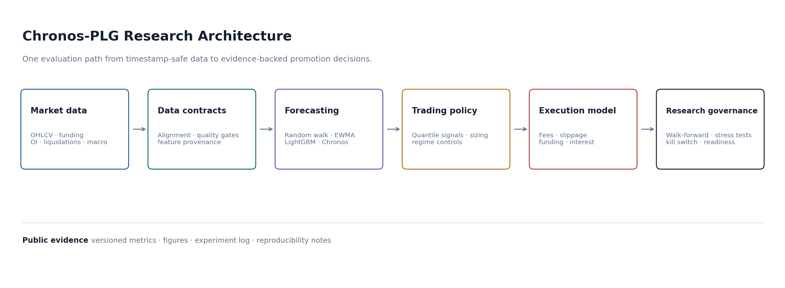

# Chronos-PLG

**Probabilistic forecasting, realistic execution economics, and model governance for BTC trading research.**

[View the repository](https://github.com/amazadfar/chronos-plg) · [Read the case study](case-study.md) · [Inspect the results](results.md)

## The Research Problem

Forecast accuracy is not the same as a tradable edge, and a positive backtest is not the same as deployment readiness.

Chronos-PLG evaluates the entire chain:

1. timestamp-safe market data
2. probabilistic return forecasts
3. cost-aware trading decisions
4. walk-forward and stress evaluation
5. paper-trading monitoring
6. explicit promotion or rejection

## Current Evidence

| Result | Net PF | Sharpe | Trades | Decision |
| --- | ---: | ---: | ---: | --- |
| Best inspected futures EWMA candidate | 1.1739 | 0.5653 | 76 | Iterate |
| Fixed-window spot campaign | 0.8509 | -0.8225 | 94 | Do not promote |
| 4h spot with looser threshold | 1.1517 | 1.3640 | 145 | Kill-switch blocked |
| 4h margin with looser threshold | 1.1346 | 1.2199 | 145 | Kill-switch blocked |

The platform can locate partial positive-edge regions. It has not yet produced a candidate that satisfies the full readiness standard.

## Why The Negative Results Matter

The fixed-window campaign remained negative, and the system refused promotion. The stronger 4h candidates produced attractive headline metrics but still triggered governance controls.

That is the intended behavior. The control layer exists to distinguish an interesting result from a defensible deployment decision.

## Capabilities Demonstrated

| Discipline | Implemented work |
| --- | --- |
| Probabilistic ML | quantile forecasting, interval-aware signals, calibration by regime |
| Evaluation science | leakage controls, frozen walk-forward folds, matched baselines, uncertainty bands |
| Quant systems | fees, slippage, funding, interest, execution transitions, market constraints |
| ML engineering | modular runners, OOF stacking, reproducible CLIs, versioned artifacts |
| Governance | robustness tests, kill switches, readiness checks, capital-ramp policy |

## Research Boundary

The repository is named for the Chronos research track, but the strongest public trading evidence is currently EWMA-led. Chronos is treated as a candidate model with strict backend provenance and fallback safeguards, not as a presumed winner.

## Continue Reading

- [Case Study](case-study.md)
- [Portfolio Copy](portfolio-copy.md)
- [Methodology](methodology.md)
- [Results](results.md)
- [Experiment Log](experiment-log.md)
- [Project Status](project-status.md)
- [Roadmap](roadmap.md)
- [Reproducibility](reproducibility.md)
