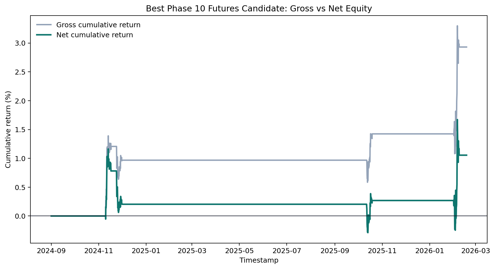
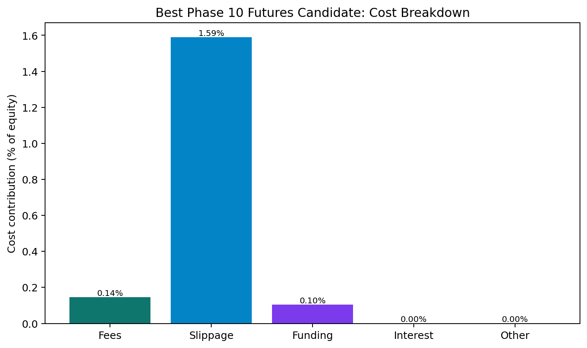
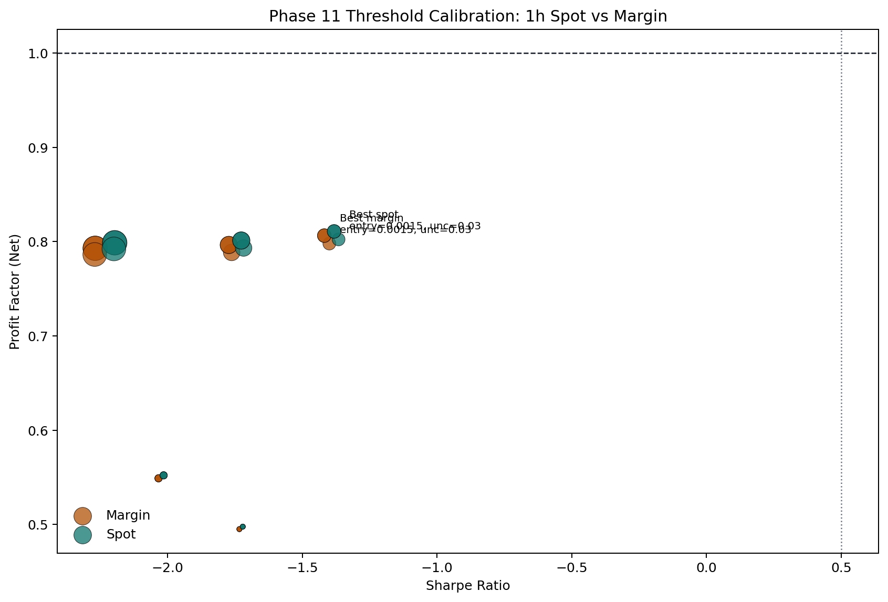
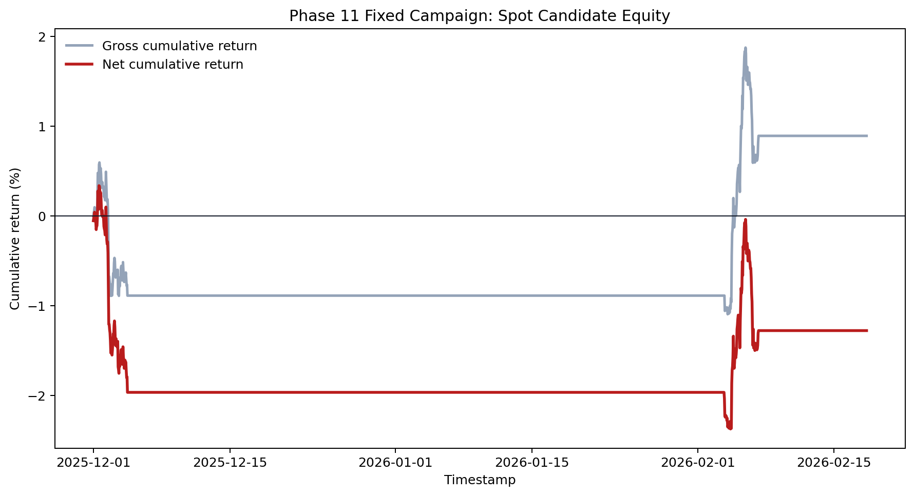
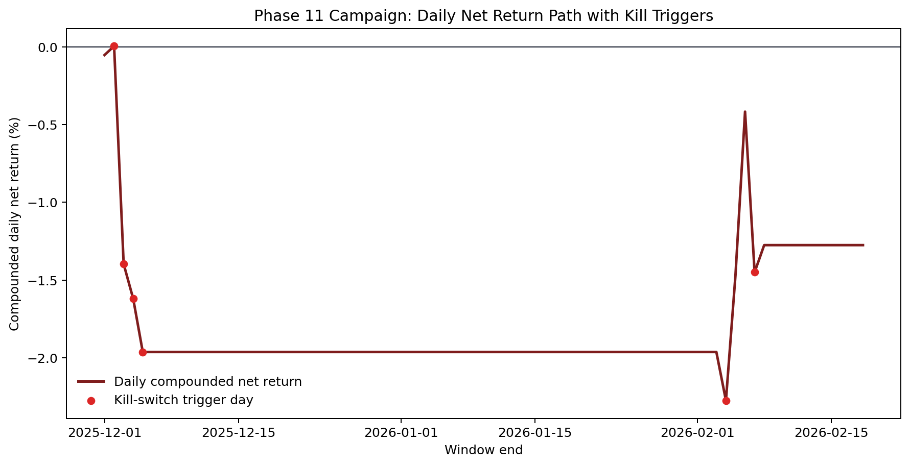
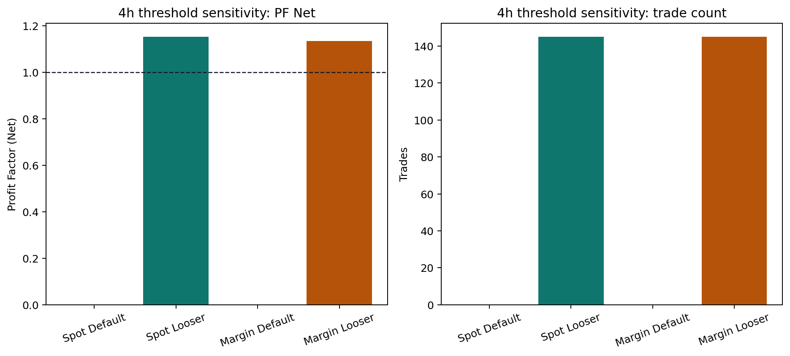

# Results

This page summarizes the most representative public evidence in the repo.

For the generated machine-readable snapshot, see:
- [`generated/public-evidence-snapshot.md`](generated/public-evidence-snapshot.md)

The repo-root artifact copies also exist under `artifacts/public/` for source control and release packaging.

## Interpretation First

The repo does not currently justify a “profitable live strategy” claim.

What it does justify:
- the system can discover partial positive-edge regions under strict cost accounting
- the governance stack is strong enough to reject those regions when they are not stable or promotion-ready
- the research process is producing informative negative evidence rather than vanity metrics

## Phase 10 Showcase

| Run | PF Net | Sharpe | Trades | Total Return | Decision |
| --- | ---: | ---: | ---: | ---: | --- |
| `ewma_candidate_sharpe565_retrain42_entry178_v4` | 1.1739 | 0.5653 | 76 | 1.05% | ITERATE |
| `ewma_candidate_span72_entry178_retrain28_v3` | 1.1213 | 0.4512 | 100 | 0.93% | ITERATE |
| `ewma` | 1.0521 | 0.1001 | 26 | 0.09% | NO_GO |
| `lightgbm` | 0.2239 | -2.4337 | 36 | -1.35% | NO_GO |

The strongest public takeaway from this section is not just that a tuned EWMA candidate crossed `PF Net > 1.0`. It is that even this candidate was still held back by the research governance rules.

## Best Observed Futures Candidate

Observed strengths:
- positive net PF
- positive Sharpe
- controlled drawdown

Observed blockers:
- not enough readiness confidence to promote
- regime stability concerns remain
- kill-switch and policy logic still matter

## Phase 11 Threshold Calibration

The 1h threshold calibration work explored a different failure mode.

Instead of low-activity, partial-positive candidates, these runs produced more trades but weak economics.

### Spot

Top active spot calibration candidates:

| Entry threshold | Uncertainty threshold | PF Net | Sharpe | Trades | Kill event rate |
| ---: | ---: | ---: | ---: | ---: | ---: |
| 0.0015 | 0.03 | 0.8024 | -1.3653 | 175 | 0.1075 |
| 0.0015 | 0.04 | 0.8108 | -1.3819 | 197 | 0.1290 |
| 0.0015 | 0.05 | 0.8108 | -1.3819 | 197 | 0.1290 |

### Margin

Top active margin calibration candidates:

| Entry threshold | Uncertainty threshold | PF Net | Sharpe | Trades | Kill event rate |
| ---: | ---: | ---: | ---: | ---: | ---: |
| 0.0015 | 0.03 | 0.7979 | -1.3995 | 175 | 0.1075 |
| 0.0015 | 0.04 | 0.8064 | -1.4183 | 197 | 0.1290 |
| 0.0015 | 0.05 | 0.8064 | -1.4183 | 197 | 0.1290 |

Interpretation:
- lowering thresholds increased activity
- higher activity did not repair PF / Sharpe
- no candidates passed the acceptance constraints

## Fixed Campaign Result

The fixed-candidate campaign result for the inspected spot candidate remained negative:

- `ProfitFactorNet = 0.8509`
- `Sharpe = -0.8225`
- `Trades = 94`
- `Kill events = 6`
- deployment readiness: `False`
- promotion recommendation: `False`

This is a strong public result, even though it is negative. It demonstrates that the repo’s control layer is doing real work instead of allowing a weak candidate to drift toward production.

## New This Session: 4h Threshold Sensitivity

To make the timeframe story more concrete, a matched 4h spot and 4h margin replay was run during this publication pass.

### Default threshold

- spot, default threshold:
  - `Trades = 0`
  - `PF Net = 0.0000`
  - `Sharpe = 0.0000`
- margin, default threshold:
  - `Trades = 0`
  - `PF Net = 0.0000`
  - `Sharpe = 0.0000`

### Looser threshold (`entry_threshold = 0.0015`, `uncertainty_threshold = 0.04`)

- 4h spot:
  - `Trades = 145`
  - `PF Net = 1.1517`
  - `Sharpe = 1.3640`
  - readiness: `False`
  - blocker: `kill_switch_triggered`
- 4h margin:
  - `Trades = 145`
  - `PF Net = 1.1346`
  - `Sharpe = 1.2199`
  - readiness: `False`
  - blocker: `kill_switch_triggered`

Interpretation:
- the 4h default threshold was too conservative for this window
- loosening the threshold recovered attractive PF / Sharpe regions
- those regions still did not qualify for readiness because kill-switch activity remained too high

## Bottom Line

The current public evidence supports this claim:

`chronos-plg` is a credible trading research platform that has already produced meaningful findings, but it has not yet produced a promotion-ready strategy.
